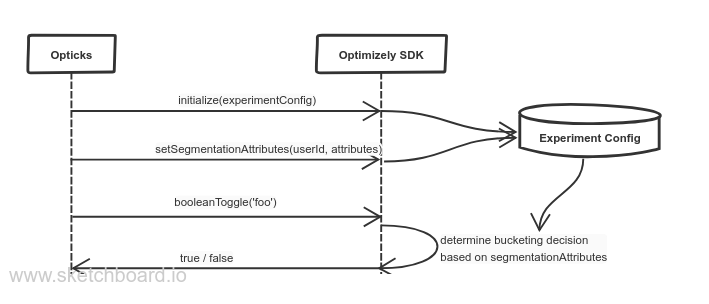

# Optimizely Integration

## Rationale

While the "simple" integration assumes you already have your bucketing done
elsewhere, the Optimizely integration is an adapter around the Optimizely Full
Stack SDK. It can be used to make on-the-fly bucketing decisions without making
any additional roundtrips, making it ideal for embedding in your client or SPA.

Once initialized, all integrations work the same way, both the consumption of
toggles and clean up with the codemods. Please refer to the main README for
details. For more information about the Optimizely SDK, see
https://docs.developers.optimizely.com/full-stack/docs.

## Overview



## Initialization

Currently the Opticks library is decoupled from the Optimizely SDK, the first
thing you should do is register the library:

```
import Optimizely from '@optimizely/optimizely-sdk'
import { registerLibrary } from 'opticks/integrations/optimizely'

registerLibrary(Optimizely)
```

Then you can initialize it with the DataFile (see below on the specifics for
Opticks):

```
import { initialize } from 'opticks/integrations/optimizely'

const datafile = {} // see: https://docs.developers.optimizely.com/full-stack/docs/example-datafile
initialize(datafile)
```

### User Id and Audience Segmentation Attributes

To be able to generate experiment decisions, the Optimizely SDK needs a user id,
and optionally a set of attributes to set up audiences to decide whether a user
is eligible for certain experiments.

The Opticks library exposes this functionality via `setUserId` and
`setAudienceSegmentationAttributes`:

```
setUserId('foo')
setAudienceSegmentationAttributes({
  deviceType: 'mobile',
  isLoggedIn: true
})
```

The `userId` is a deterministic factor for the bucketing algorithm and is
mandatory. The audience segmentation attributes are optional and is expected to
be an object with any extra information you'd like to use to include / exclude
users from a particular Experiment or Feature Flag (called Audiences in
Optimizely terms).

Attributes can be strings or booleans, and Audiences are set up by defining
restrictions on them. For instance you can create an audience for visitors with
a mobile device, another for logged in users. It's also possible to use boolean
logic to combine multiple attributes, for instance people that are logged in but
are _not_ using a mobile device.

The decoupling of the Audiences from the Toggle consumption allows you to keep
the consumers of the test agnostic of which they are targeted, allowing for
easy clean up.

#### Setting or overriding individual segmentation attributes

Since it might be the case that not all segmentation attributes are known at the
same time, or their values might change during the lifetime of the application,
you can also set or override individual segmentation attributes via
`setAudienceSegmentationAttribute`:

```
setAudienceSegmentationAttribute('deviceType', 'mobile')
setAudienceSegmentationAttribute('isLoggedIn', false)
```

Please refer to the
[DataFile section](#the-datafile)
for more information on how to set up Feature Flags, Experiments and Audiences.

Once set, these `userId` and audience segmentation attributes are automatically
forwarded to Optimizely with each call.

### The DataFile

The Opticks Optimizely integration makes some assumptions on how the experiments
are set up. Optimizely supports two types of flags, "Feature Flags" and Experiments .
The Opticks library uses certain conventions to wrap both concepts in a
predictable API, where experiment variations are in the `a`, `b`, `c` format.

The following is subject to change, but right now Opticks uses both Feature
Flags and the Experiments concepts of the Optimizely SDK which means you'll need
to add both to the DataFile to avoid confusion in the consuming API.

Please refer to the
[example DataFile](../src/integrations/__fixtures__/dataFile.js) used in the
unit tests on how to set up Feature Flags and Experiments.

#### Anatomy of an Experiment

NOTE: Subject to change in the future.

```
experiments: [
  {
    id: 'foo', // used in the featureFlags section
    key: 'foo',
    status: 'Running',
    layerId: 'layerFoo', // not used at the moment
    variations: [
      {
        featureEnabled: false,
        id: '1', // referred to from the trafficAllocation configuration
        key: 'a'
      },
      {
        featureEnabled: true,
        id: '2',
        key: 'b'
      }
    ],
    trafficAllocation: [
      // example of a 50/50 split
      {
        entityId: '1',
        endOfRange: 5000
      },
      {
        entityId: '2',
        endOfRange: 10000
      }
    ],
    // see audiences
    audienceIds: ['foo-default-dates'],
    forcedVariations: []
  }
]
```

#### Anatomy of a Feature Flag

```
featureFlags: [
  {
    // see experiments
    experimentIds: ['foo'],
    id: 'foo',
    key: 'foo'
  }
]
```

#### Anatomy of an Audience

```
audiences: [
  {
    id: 'foo-default-dates', // used in experiment
    name: 'Foo Traffic',
    // all attributes are custom_attributes
    conditions:
      '[ "and", { "name": "trafficSource", "value": "foo", "type": "custom_attribute" }, { "name": "hasDefaultDates", "value": true, "type": "custom_attribute" } ]'
  }
],
```

### Activation Event Handlers

The Optimizely library supports events and hooks, some of which are exposed
through Opticks. For instance, you can use the "Activation" event to track when
experiments decisions are requested, and which variation a user is assigned to.

The initialize function supports a second argument for the activation handler.
It exposes the raw event from the Optimizely SDK you can use to send data to
your analytics system as you please:

```
initialize(datafile, (activationEvent) => console.log(activationEvent))
```

## Cached Decisions

Since the
[Audience Segmentation Attributes](#user-id-and-audience-segmentation-attributes)
are deterministic for the bucketing algorithm, Opticks caches the decisions
until you call `audienceSegmentationAttributes` with new values.
This means you're free to request the same Feature Flag or Experiment decision
in multiple places, but the experiment
[activation event](#activation-event-handlers) is only called once per
experiment.
